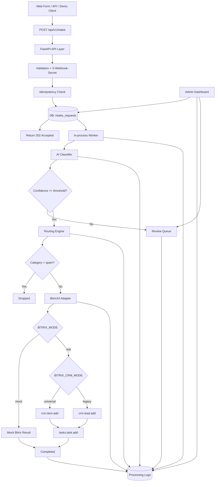

# Техническое задание v1.0

# AI Lead Intake для Битрикс24

**Тип документа:** production-oriented technical specification / implementation brief / portfolio case  
**Статус:** финальная версия для подготовки и реализации через Cursor  
**Формат проекта:** production-capable core + demo/portfolio delivery profile  
**Целевая роль:** специалист по AI-автоматизации CRM и бизнес-процессов  
**Дата:** июль 2026  
**Базовый путь проекта:** `C:\dev_bitrix24\ai_lead_intake_bitrix24`  

---


## 1. Краткое описание

**AI Lead Intake для Битрикс24** — production-capable модуль первичной обработки входящих заявок для CRM Битрикс24.

Система принимает входящую заявку из web/API/demo-source, сохраняет её в очереди, анализирует через AI, определяет intent, категорию, приоритет и ответственного, создаёт CRM-сущность и задачу в Битрикс24, сохраняет черновик ответа клиенту, а спорные случаи отправляет на ручную проверку.

Короткая формула:

```text
Заявка → AI intent classification → smart routing → Bitrix24 CRM → Task → Draft reply → Human review → Logs
```

Проект демонстрирует связку:

```text
CRM + Битрикс24 + API/webhooks + AI-классификация + smart routing + human-in-the-loop + production-thinking
```

---

## 2. Версии поставки

### 2.1 Demo / Portfolio MVP

Первая версия, которую реализуем через Cursor.

Особенности:

- синтетические данные;
- локальный запуск;
- SQLite;
- mock AI и mock Bitrix24 mode;
- real OpenAI и real Bitrix24 mode через `.env`;
- простая admin UI;
- без коммерческого утверждения “реальное внедрение”;
- без настоящих клиентских персональных данных;
- без SaaS/multitenant.

Цель: показать работодателю сильный end-to-end кейс.

### 2.2 Internal Production App

Следующий уровень развития.

Особенности:

- PostgreSQL;
- Alembic migrations;
- полноценная очередь задач;
- более строгая авторизация;
- журнал аудита;
- деплой на VPS/сервер;
- real Bitrix24 portal;
- ограничение доступа;
- production secrets management;
- расширенный monitoring.

Цель: использовать как внутренний модуль компании или как основу для коммерческого внедрения.

### 2.3 SaaS / Marketplace App

Не входит в текущий scope.

Потребует:

- OAuth Bitrix24 app;
- multi-tenant;
- изоляция порталов;
- billing;
- RBAC;
- compliance;
- marketplace packaging;
- SLA/monitoring;
- support process.

Это отдельный проект, не цель текущего портфолио-кейса.

---

## 3. Главный ответ на вопрос “демо или боевой?”

Если сделать “просто демо”, потом боевой продукт придётся частично переписывать.

Если сразу делать “полный боевой enterprise”, проект раздуется и не будет быстро реализован.

Поэтому выбираем третий путь:

> **Production-first design, demo-first delivery.**

Это значит:

| Область | В первой версии | Заложено для будущего |
|---|---|---|
| DB | SQLite | совместимость с PostgreSQL |
| Worker | in-process DB queue | замена на Celery/RQ/ARQ позже |
| Bitrix24 | webhook + mock/real | adapter interface, field mapping |
| AI | mock/OpenAI | provider abstraction |
| Auth | Basic Auth + webhook secret | RBAC/OAuth позже |
| Data | synthetic demo data | PII policy, audit, masking |
| Deployment | Docker Compose local | VPS/server profile позже |
| UI | Jinja2/HTMX | можно заменить frontend позже |
| Logs | DB logs | structured logs/observability позже |

---

## 4. Проблема

В компаниях с CRM часто возникают типовые проблемы при обработке входящих обращений:

- заявки приходят из разных источников;
- менеджеры вручную читают и сортируют обращения;
- лиды попадают не тем ответственным;
- часть заявок теряется или обрабатывается с задержкой;
- контактные данные переносятся в CRM вручную;
- дубли и неполные карточки ухудшают качество CRM;
- первичный ответ клиенту готовится вручную;
- руководитель не видит, какие заявки обработаны автоматически, какие зависли, а какие требуют проверки.

Проект решает эту проблему как модуль между источником заявки и Битрикс24.

---

## 5. Цель проекта

Создать рабочий продуктовый прототип, который показывает полный процесс:

```text
входящая заявка → очередь → AI-анализ → классификация → routing → Битрикс24 → задача → логирование → dashboard
```

Цель — показать не “AI-парсер текста”, а зрелый **CRM automation product prototype** с элементами production-thinking:

- state machine;
- idempotency;
- retry/backoff;
- human-in-the-loop;
- PII masking;
- mock/real integration mode;
- adapter abstraction;
- field mapping;
- tests;
- documentation;
- GitHub workflow;
- visual portfolio packaging.

---

## 6. Что демонстрирует кейс

| Навык | Как проявляется в проекте |
|---|---|
| Битрикс24 | создание CRM-сущности и задачи через REST API |
| CRM-анализ | категории заявок, приоритеты, ответственные, статусы |
| API/webhooks | intake endpoint, Bitrix24 webhook integration |
| AI Automation | intent detection, extraction, summary, draft reply |
| Системный анализ | state machine, edge cases, data flow, boundaries |
| Бизнес-анализ | типовой процесс обработки входящих обращений |
| Интеграции | adapters, field mapping, retry, error handling |
| Безопасность | `.env`, masking, auth, rate limiting |
| Инженерная дисциплина | tests, Docker, README, ADR, GitHub workflow |
| AI-разработка | Cursor prompts, AGENTS.md, coding rules, incremental delivery |

---

## 7. Принципы проекта

1. **Честное позиционирование.**  
   Первая поставка — `demo case / product prototype`, не коммерческое внедрение.

2. **Production-capable архитектура.**  
   Не хардкодить решения, которые потом помешают боевому развитию.

3. **Без enterprise-overengineering.**  
   Без Kubernetes, Kafka, RabbitMQ, Celery, OAuth marketplace app и мультитенантности в MVP.

4. **Ясные расширяемые границы.**  
   Всё, что не входит в MVP, должно быть отражено в roadmap.

5. **AI не принимает критические решения без контроля.**  
   Low confidence, неоднозначность, ошибки и спорные случаи уходят в review.

6. **Без реальных персональных данных в публичном проекте.**  
   Demo data только синтетические.

7. **Cursor-friendly разработка.**  
   Проект разбивается на блоки, epics, prompts, acceptance criteria.

8. **GitHub как инженерный след.**  
   Коммиты, issues, docs, ADR и README должны показывать системный подход.

---

## 8. Scope v2.0

### 8.1 Обязательно входит в Demo MVP

- `POST /api/v1/intake` — приём входящей заявки.
- Валидация входных данных через Pydantic.
- `X-Webhook-Secret` для защиты intake endpoint.
- Idempotency key для защиты от дублей.
- Сохранение заявки в SQLite.
- In-process worker для обработки очереди заявок.
- State machine.
- AI-классификация через Structured Outputs / JSON Schema.
- AI provider mode: `mock` / `openai`.
- Confidence gate:
  - `confidence >= 0.75` → автоматическая обработка;
  - `confidence < 0.75` → ручная проверка.
- YAML routing rules.
- Field mapping для Bitrix24.
- Mock Bitrix24 mode.
- Real Bitrix24 mode через `.env`.
- CRM mode:
  - `universal` → `crm.item.add`;
  - `legacy` → `crm.lead.add`.
- Создание задачи ответственному через `tasks.task.add`.
- Генерация черновика ответа клиенту без автоотправки.
- Dashboard:
  - список заявок;
  - карточка заявки;
  - AI-результат;
  - routing decision;
  - Bitrix24 result;
  - timeline логов;
  - review queue;
  - approve/retry/drop/reprocess actions.
- PII masking в логах, UI и screenshots.
- Basic Auth для admin UI.
- Rate limiting для `/api/v1/intake`.
- Demo seed data.
- 10+ ключевых тестов.
- Docker Compose.
- README.
- docs для Notion/HH/GitHub.
- AGENTS.md и Cursor rules.
- GitHub-friendly структура.

### 8.2 Production-ready seams, которые закладываем сразу

- DB layer не должен зависеть от SQLite-специфики.
- Конфиг через `.env`, без хардкода.
- Адаптеры AI и Bitrix24 изолированы.
- Field mapping вынесен в YAML.
- State machine централизована.
- Worker можно заменить на внешнюю очередь.
- Auth/security вынесены в отдельный модуль.
- Logs и status transitions структурированы.
- Tests используют mock clients, без внешних сетевых вызовов.
- Demo data отделена от production data.

### 8.3 Можно позже

- PostgreSQL.
- Alembic migrations.
- Celery/RQ/ARQ.
- Email/IMAP intake.
- Telegram approval bot.
- WhatsApp/Telegram входящие источники.
- Analytics dashboard.
- Routing rules editor в UI.
- Создание контакта/компании/сделки.
- Поиск дублей в Bitrix24.
- Проверка контрагента через 1С или внешние источники.
- GitHub Actions CI.
- Деплой на VPS.
- Video demo.
- Role-based access control.

### 8.4 Не делать в MVP

- React/Vue/Solid frontend.
- Celery/Redis как обязательную зависимость.
- OAuth-приложение Битрикс24.
- Marketplace app для Битрикс24.
- SaaS/multitenant.
- Kubernetes.
- Kafka/RabbitMQ.
- Auto-send ответа клиенту.
- Реальные клиентские данные.
- Выдуманные коммерческие метрики.
- 1С-интеграцию внутри этого кейса.
- Полноценный BI-дашборд.
- Сложную многоуровневую систему ролей.

---

## 9. Архитектура

### 9.1 Общая схема



### 9.2 Ключевое архитектурное решение

Используется схема:

```text
POST /intake → save to DB → return 202 → worker processes queue
```

Преимущества:

- быстрый ответ внешней системе;
- защита от таймаутов AI/Bitrix24;
- retry/replay;
- прозрачные статусы;
- демонстрация state machine;
- возможность перейти к внешнему worker позже.

### 9.3 Почему не обычный BackgroundTasks

FastAPI BackgroundTasks полезны для операций после ответа клиенту, но для нашего кейса лучше DB queue + in-process worker, потому что нужна наблюдаемая очередь, статусы, retry, replay и демонстрация processing pipeline.

### 9.4 Почему не Celery/Redis сразу

Celery/Redis полезны для боевой масштабируемой обработки, но в портфолио MVP это лишняя инфраструктурная сложность. Вместо этого закладываем интерфейс worker/service так, чтобы позже заменить in-process worker на внешнюю очередь.

---

## 10. Технический стек

| Слой | Технология |
|---|---|
| Backend | Python 3.12 + FastAPI |
| DB | SQLite для Demo MVP |
| ORM | SQLAlchemy 2 |
| Validation | Pydantic |
| AI | OpenAI API / OpenAI-compatible provider / mock |
| AI output | Structured Outputs / JSON Schema |
| Bitrix24 integration | REST API via incoming webhook |
| UI | Jinja2 + HTMX + Tailwind CDN |
| Retry | tenacity |
| HTTP client | httpx |
| Config | `.env` + `routing.yaml` + `field_mapping.yaml` |
| Tests | pytest |
| Lint/format | ruff |
| Type checking | optional mypy later |
| Deploy | Docker Compose |
| Auth | Basic Auth для admin, `X-Webhook-Secret` для intake |

---

## 11. Bitrix24 integration strategy

### 11.1 Режимы интеграции

```env
BITRIX_MODE=mock
# или
BITRIX_MODE=real
```

### 11.2 CRM API mode

```env
BITRIX_CRM_MODE=universal
# или
BITRIX_CRM_MODE=legacy
```

### 11.3 Universal mode

Основной режим:

```text
crm.item.add
```

Для Lead:

```text
entityTypeId = 1
```

### 11.4 Legacy mode

Compatibility mode:

```text
crm.lead.add
```

Используется только если universal mode не подходит для конкретного портала или для упрощённой демонстрации.

### 11.5 Task creation

Для задач:

```text
tasks.task.add
```

Минимальные поля:

```text
TITLE
RESPONSIBLE_ID
```

Для связи с CRM-лидом:

```text
UF_CRM_TASK = ["L_{bitrix_lead_id}"]
```

### 11.6 Field mapping

Bitrix24-поля отличаются между порталами, особенно пользовательские поля. Поэтому маппинг не хардкодится в коде.

Используется:

```text
config/field_mapping.yaml
```

---

## 12. State machine

### 12.1 Статусы заявки

```text
received
processing
classified
review_needed
routed
bitrix_syncing
completed
failed
failed_retryable
dropped
duplicate
```

### 12.2 Статусы и переходы

| From | Condition | To |
|---|---|---|
| new request | valid payload | received |
| received | worker picked | processing |
| processing | valid AI output | classified |
| processing | AI error/timeout/invalid schema | review_needed |
| classified | confidence < threshold | review_needed |
| classified | category spam | dropped |
| classified | confidence ok | routed |
| routed | Bitrix sync started | bitrix_syncing |
| bitrix_syncing | Bitrix success | completed |
| bitrix_syncing | temporary error | failed_retryable |
| failed_retryable | retry_count exceeded | failed |
| any | admin drops request | dropped |
| review_needed | admin approves | routed |

---

## 13. Data flow

1. Внешняя система отправляет `POST /api/v1/intake`.
2. API проверяет `X-Webhook-Secret`.
3. Pydantic валидирует payload.
4. Система проверяет `idempotency_key`.
5. Если заявка уже была — возвращается существующий `request_id`, новая запись не создаётся.
6. Если заявка новая — создаётся запись со статусом `received`.
7. API возвращает `202 Accepted`.
8. Worker берёт заявки в статусе `received` / `failed_retryable`.
9. Статус меняется на `processing`.
10. AI Classifier получает текст заявки и возвращает строгий JSON.
11. Ответ AI валидируется через Pydantic.
12. Если AI-ответ невалидный — статус `review_needed`.
13. Если `confidence < 0.75` — статус `review_needed`.
14. Если категория `spam` — статус `dropped`, Bitrix24 не вызывается.
15. Routing Engine выбирает ответственного по YAML.
16. Статус меняется на `routed`.
17. Bitrix24 Adapter создаёт CRM item / lead.
18. Bitrix24 Adapter создаёт задачу.
19. Система сохраняет ID сущностей и ссылки.
20. Статус меняется на `completed`.
21. Все шаги пишутся в `processing_logs`.

---

## 14. API

### 14.1 Public endpoints

```text
POST /api/v1/intake
GET  /api/v1/intake/{request_id}
```

### 14.2 Admin endpoints

```text
GET  /
GET  /admin/requests
GET  /admin/requests/{request_id}
GET  /admin/review
GET  /admin/settings
POST /admin/requests/{request_id}/approve
POST /admin/requests/{request_id}/retry
POST /admin/requests/{request_id}/drop
POST /admin/requests/{request_id}/reprocess-ai
```

### 14.3 System endpoints

```text
GET /health
GET /docs
```

---

## 15. Intake request schema

```json
{
  "idempotency_key": "site-form-20260702-0001",
  "source": "web_form",
  "name": "Иван Петров",
  "email": "ivan.petrov@example.com",
  "phone": "+37360000000",
  "company": "ООО Ромашка",
  "message": "Здравствуйте. Хотим внедрить Битрикс24 и связать его с 1С. Нужна оценка сроков и стоимости.",
  "utm_source": "website",
  "created_at": "2026-07-02T18:30:00Z"
}
```

### 15.1 Минимальные обязательные поля

```text
idempotency_key
source
message
```

### 15.2 Ограничения

- `message` не пустой;
- максимальная длина `message`: 10 000 символов;
- email валидируется, если передан;
- phone нормализуется, если передан;
- HTML очищается;
- лишние пробелы удаляются;
- raw payload не логируется полностью.

---

## 16. AI classification

### 16.1 Категории

```python
category: Literal[
    "crm_implementation",
    "integration_1c",
    "business_process_automation",
    "ai_automation",
    "support",
    "partnership",
    "complaint",
    "spam",
    "other"
]
```

### 16.2 Priority

```python
priority: Literal["low", "medium", "high", "critical"]
```

### 16.3 Pydantic schema

```python
from typing import Literal, Optional
from pydantic import BaseModel, Field

class ExtractedContact(BaseModel):
    name: Optional[str] = None
    email: Optional[str] = None
    phone: Optional[str] = None
    company: Optional[str] = None

class AIClassification(BaseModel):
    category: Literal[
        "crm_implementation",
        "integration_1c",
        "business_process_automation",
        "ai_automation",
        "support",
        "partnership",
        "complaint",
        "spam",
        "other"
    ]

    priority: Literal["low", "medium", "high", "critical"]

    confidence: float = Field(ge=0.0, le=1.0)

    intent: str = Field(description="Краткое описание намерения клиента")

    summary: str = Field(description="Суть обращения в 1-2 предложениях")

    contact: ExtractedContact

    product_interest: Optional[str] = None

    suggested_tone: Literal["formal", "friendly", "urgent"]

    draft_reply: str = Field(
        description="Черновик первого ответа клиенту. Не отправляется автоматически."
    )

    reasoning: str = Field(
        description="Краткое объяснение категории, приоритета и confidence"
    )

    needs_human_review: bool
```

### 16.4 AI prompt

```text
Ты — AI-ассистент для первичной обработки входящих заявок в CRM Битрикс24.

Твоя задача:
1. Извлечь контактные данные.
2. Определить категорию обращения.
3. Определить приоритет.
4. Сформулировать intent и summary.
5. Подготовить черновик первого ответа клиенту.
6. Оценить confidence от 0 до 1.
7. Определить, нужна ли ручная проверка.

Правила:
- Верни только JSON по заданной схеме.
- Не добавляй markdown.
- Не выдумывай телефон, email, имя или компанию.
- Если данные отсутствуют — используй null.
- Если обращение неоднозначное — confidence ниже 0.75 и needs_human_review=true.
- Если это спам или нерелевантное сообщение — category=spam.
- Черновик ответа должен быть вежливым, коротким и без обещаний сроков/стоимости.
- Нельзя автоматически обещать скидки, договор, точную цену, сроки или начало работ.
```

### 16.5 Пример AI output

```json
{
  "category": "integration_1c",
  "priority": "high",
  "confidence": 0.91,
  "intent": "Клиент хочет оценить интеграцию Битрикс24 с 1С",
  "summary": "Компания планирует внедрить Битрикс24 и связать его с 1С. Нужна первичная оценка сроков и стоимости.",
  "contact": {
    "name": "Иван Петров",
    "email": "ivan.petrov@example.com",
    "phone": "+37360000000",
    "company": "ООО Ромашка"
  },
  "product_interest": "Битрикс24 + 1С интеграция",
  "suggested_tone": "formal",
  "draft_reply": "Здравствуйте, Иван. Спасибо за обращение. Можем предварительно обсудить задачу по внедрению Битрикс24 и интеграции с 1С. Для оценки потребуется уточнить текущую конфигурацию 1С, сценарии обмена и желаемую CRM-логику.",
  "reasoning": "В обращении явно указаны Битрикс24, 1С и запрос на оценку сроков и стоимости. Это профильная интеграционная заявка с высоким коммерческим потенциалом.",
  "needs_human_review": false
}
```

---

## 17. Routing rules

### 17.1 `config/routing.yaml`

```yaml
defaults:
  confidence_threshold: 0.75
  default_responsible_id: 1
  review_responsible_id: 1
  task_deadline_hours: 24

rules:
  - id: "critical_complaint"
    conditions:
      category: "complaint"
      priority: ["high", "critical"]
    action:
      responsible_id: 1
      create_task: true
      task_deadline_hours: 1
      task_title: "⚠️ Срочная жалоба: {intent}"

  - id: "integration_1c"
    conditions:
      category: "integration_1c"
    action:
      responsible_id: 2
      create_task: true
      task_deadline_hours: 4
      task_title: "Интеграция с 1С: {intent}"

  - id: "crm_implementation"
    conditions:
      category: "crm_implementation"
    action:
      responsible_id: 3
      create_task: true
      task_deadline_hours: 8
      task_title: "Внедрение CRM: {intent}"

  - id: "business_process_automation"
    conditions:
      category: "business_process_automation"
    action:
      responsible_id: 3
      create_task: true
      task_deadline_hours: 8
      task_title: "Автоматизация процессов: {intent}"

  - id: "ai_automation"
    conditions:
      category: "ai_automation"
    action:
      responsible_id: 4
      create_task: true
      task_deadline_hours: 8
      task_title: "AI-автоматизация: {intent}"

  - id: "support"
    conditions:
      category: "support"
    action:
      responsible_id: 5
      create_task: true
      task_deadline_hours: 4
      task_title: "Поддержка: {intent}"

  - id: "spam"
    conditions:
      category: "spam"
    action:
      drop: true
      create_task: false

  - id: "fallback"
    conditions: {}
    action:
      responsible_id: 1
      create_task: true
      task_deadline_hours: 24
      task_title: "Новая заявка: {intent}"
```

### 17.2 Логика routing engine

- Правила применяются сверху вниз.
- Первое совпавшее правило побеждает.
- `conditions: {}` означает fallback.
- `drop: true` означает не создавать сущности в Битрикс24.
- `eval()` запрещён.
- Подстановка в шаблоны должна быть безопасной.
- Если правило невалидно, worker не должен падать полностью; ошибка фиксируется в logs.

---

## 18. Field mapping

### 18.1 `config/field_mapping.yaml`

```yaml
bitrix:
  universal:
    entity_type_id: 1
    fields:
      title: "title"
      name: "name"
      company: "companyTitle"
      source_id: "sourceId"
      source_description: "sourceDescription"
      assigned_by_id: "assignedById"
      comments: "comments"
      ai_category: "ufCrmAiCategory"
      ai_confidence: "ufCrmAiConfidence"
      intake_id: "ufCrmIntakeId"

  legacy:
    fields:
      title: "TITLE"
      name: "NAME"
      company: "COMPANY_TITLE"
      source_id: "SOURCE_ID"
      assigned_by_id: "ASSIGNED_BY_ID"
      comments: "COMMENTS"
      phone: "PHONE"
      email: "EMAIL"
      ai_category: "UF_CRM_AI_CATEGORY"
      ai_confidence: "UF_CRM_AI_CONFIDENCE"
      intake_id: "UF_CRM_INTAKE_ID"
```

---

## 19. Bitrix24 payloads

### 19.1 Universal CRM payload

```python
{
    "entityTypeId": 1,
    "fields": {
        "title": "[AI Intake] {intent}",
        "name": "{contact_name}",
        "companyTitle": "{company}",
        "sourceId": "WEB",
        "sourceDescription": "AI Lead Intake",
        "assignedById": responsible_id,
        "comments": """
Категория: {category}
Приоритет: {priority}
Confidence: {confidence}

Summary:
{summary}

AI Draft Reply:
{draft_reply}

Intake ID:
{intake_id}
        """,
        "ufCrmAiCategory": category,
        "ufCrmAiConfidence": str(confidence),
        "ufCrmIntakeId": intake_id
    }
}
```

### 19.2 Legacy lead payload

```python
{
    "fields": {
        "TITLE": "[AI Intake] {intent}",
        "NAME": "{contact_name}",
        "COMPANY_TITLE": "{company}",
        "ASSIGNED_BY_ID": responsible_id,
        "SOURCE_ID": "WEB",
        "COMMENTS": "{comments}",
        "PHONE": [
            {"VALUE": "{phone}", "VALUE_TYPE": "WORK"}
        ],
        "EMAIL": [
            {"VALUE": "{email}", "VALUE_TYPE": "WORK"}
        ],
        "UF_CRM_AI_CATEGORY": "{category}",
        "UF_CRM_AI_CONFIDENCE": "{confidence}",
        "UF_CRM_INTAKE_ID": "{intake_id}"
    }
}
```

### 19.3 Task payload

```python
{
    "fields": {
        "TITLE": "{task_title}",
        "RESPONSIBLE_ID": responsible_id,
        "DEADLINE": deadline_iso,
        "DESCRIPTION": """
AI Lead Intake создал задачу по новой заявке.

Категория: {category}
Приоритет: {priority}
Intent: {intent}

Что сделать:
1. Проверить карточку лида.
2. Уточнить потребность клиента.
3. Использовать или отредактировать черновик ответа.
4. Зафиксировать следующий шаг в CRM.

Черновик ответа:
{draft_reply}
        """,
        "UF_CRM_TASK": ["L_{bitrix_lead_id}"],
        "PRIORITY": "2" if priority in ["high", "critical"] else "1"
    }
}
```

---

## 20. Data model

### 20.1 `intake_requests`

```sql
id                    TEXT PRIMARY KEY
idempotency_key       TEXT UNIQUE NOT NULL
source                TEXT NOT NULL
raw_payload_masked    TEXT NOT NULL
raw_text              TEXT NOT NULL
status                TEXT NOT NULL
error_message          TEXT NULL
retry_count            INTEGER DEFAULT 0
created_at             TEXT NOT NULL
updated_at             TEXT NOT NULL
```

### 20.2 `ai_classifications`

```sql
id                    TEXT PRIMARY KEY
intake_id             TEXT NOT NULL
category              TEXT
priority              TEXT
confidence            REAL
intent                TEXT
summary               TEXT
contact_name          TEXT NULL
contact_email_masked  TEXT NULL
contact_phone_masked  TEXT NULL
company               TEXT NULL
product_interest      TEXT NULL
suggested_tone        TEXT
needs_human_review    BOOLEAN
draft_reply            TEXT
reasoning             TEXT
model_used             TEXT
raw_ai_response        TEXT
created_at             TEXT NOT NULL
```

### 20.3 `routing_decisions`

```sql
id                    TEXT PRIMARY KEY
intake_id             TEXT NOT NULL
rule_id               TEXT
responsible_id         INTEGER
action                TEXT
create_task            BOOLEAN
task_deadline_hours    INTEGER
task_title             TEXT
created_at             TEXT NOT NULL
```

### 20.4 `bitrix_entities`

```sql
id                    TEXT PRIMARY KEY
intake_id             TEXT NOT NULL
entity_type            TEXT NOT NULL
bitrix_id              TEXT NULL
bitrix_url             TEXT NULL
status                TEXT NOT NULL
error_message          TEXT NULL
created_at             TEXT NOT NULL
```

### 20.5 `processing_logs`

```sql
id                    TEXT PRIMARY KEY
intake_id             TEXT NOT NULL
event                 TEXT NOT NULL
status                TEXT NOT NULL
details               TEXT NULL
created_at             TEXT NOT NULL
```

### 20.6 Production extension later

Для боевого режима позже добавить:

```text
users
audit_logs
integrations
portal_settings
crm_field_mappings
webhook_events
```

---

## 21. Project structure

```text
ai-lead-intake-bitrix24/
├── app/
│   ├── main.py
│   ├── config.py
│   ├── database.py
│   │
│   ├── api/
│   │   ├── intake.py
│   │   ├── admin.py
│   │   └── health.py
│   │
│   ├── models/
│   │   ├── db.py
│   │   └── schemas.py
│   │
│   ├── services/
│   │   ├── intake_service.py
│   │   ├── ai_classifier.py
│   │   ├── routing_engine.py
│   │   ├── bitrix_service.py
│   │   └── worker.py
│   │
│   ├── integrations/
│   │   ├── bitrix24_client.py
│   │   └── llm_client.py
│   │
│   ├── utils/
│   │   ├── pii_masker.py
│   │   ├── idempotency.py
│   │   └── security.py
│   │
│   ├── templates/
│   │   ├── base.html
│   │   ├── dashboard.html
│   │   ├── request_detail.html
│   │   └── review_queue.html
│   │
│   └── static/
│       └── app.css
│
├── config/
│   ├── routing.yaml
│   └── field_mapping.yaml
│
├── demo_data/
│   └── sample_requests.json
│
├── scripts/
│   └── seed_demo_data.py
│
├── tests/
│   ├── conftest.py
│   ├── test_intake_api.py
│   ├── test_ai_classifier.py
│   ├── test_routing_engine.py
│   ├── test_bitrix24_client.py
│   ├── test_worker.py
│   ├── test_human_review.py
│   └── test_pii_masking.py
│
├── docs/
│   ├── ai_lead_intake_bitrix24_tz_v1_0.md
│   ├── ai_lead_intake_bitrix24_tz_v2_0.md
│   ├── project_brief.md
│   ├── architecture.md
│   ├── implementation_plan.md
│   ├── notion_case.md
│   ├── screenshots_plan.md
│   ├── epics/
│   ├── adr/
│   ├── prompts/
│   └── checklists/
│
├── .cursor/
│   └── rules/
│       ├── project_rules.md
│       ├── python_fastapi_rules.md
│       ├── testing_rules.md
│       ├── security_rules.md
│       └── git_rules.md
│
├── AGENTS.md
├── .env.example
├── .gitignore
├── Dockerfile
├── docker-compose.yml
├── pyproject.toml
└── README.md
```

---

## 22. Environment variables

### 22.1 `.env.example`

```env
APP_ENV=demo
APP_DEBUG=true
APP_BASE_URL=http://localhost:8000

DATABASE_URL=sqlite:///./data/app.db

INTAKE_WEBHOOK_SECRET=change_me
ADMIN_USERNAME=admin
ADMIN_PASSWORD=change_me

AI_PROVIDER=mock
OPENAI_API_KEY=
OPENAI_MODEL=gpt-4o-mini
CONFIDENCE_THRESHOLD=0.75

BITRIX_MODE=mock
BITRIX_CRM_MODE=universal
BITRIX24_WEBHOOK_URL=
BITRIX24_BASE_URL=

RATE_LIMIT_INTAKE=10/minute
WORKER_POLL_INTERVAL_SECONDS=2
WORKER_BATCH_SIZE=5
MAX_RETRY_COUNT=3
```

---

## 23. Security / privacy

### 23.1 Обязательно реализовать

- `.env` в `.gitignore`.
- `.sqlite`, `data/`, `logs/` в `.gitignore`.
- `BITRIX24_WEBHOOK_URL` только в `.env`.
- `OPENAI_API_KEY` только в `.env`.
- `X-Webhook-Secret` для `/api/v1/intake`.
- Basic Auth для `/admin/*`.
- Rate limiting для `/api/v1/intake`.
- Demo data только синтетическая.
- Email/phone маскируются в UI и logs.
- Сырые payload не логируются полностью.
- Dockerfile запускает приложение не от root.
- Public GitHub repo не должен содержать секреты, реальные payload, SQLite DB, логи.

### 23.2 PII masking examples

```text
ivan.petrov@example.com → i***@example.com
+37360000000 → +373***0000
```

### 23.3 Production note

В demo-режиме данные синтетические. Для production-варианта необходимо отдельно решить:

- где хранить PII;
- нужен ли encryption at rest;
- retention policy;
- audit log;
- access control;
- правовое основание обработки данных;
- политика передачи данных в LLM.

---

## 24. Error handling

| Ошибка | Поведение |
|---|---|
| Неверный `X-Webhook-Secret` | `401 Unauthorized` |
| Невалидный payload | `422 Validation Error` |
| Повторный `idempotency_key` | вернуть существующий `request_id`, не создавать дубль |
| AI timeout | `review_needed` |
| AI invalid JSON | `review_needed` |
| Low confidence | `review_needed` |
| Category spam | `dropped` |
| Bitrix24 429 | retry with exponential backoff + jitter |
| Bitrix24 5xx | retry, затем `failed_retryable` / `failed` |
| Bitrix24 400 | `failed`, retry не делать |
| Bitrix24 401/403 | `failed`, critical config error |
| Invalid routing config | `failed`, event in logs |
| Missing field mapping | `failed`, event in logs |

---

## 25. Dashboard

### 25.1 `GET /`

Назначение: очередь заявок.

Колонки:

```text
ID
Дата
Источник
Категория
Приоритет
Confidence
Статус
Ответственный
Bitrix ID
Действие
```

Цвета статусов:

```text
completed        green
review_needed    yellow
failed           red
failed_retryable orange
processing       blue
dropped          gray
duplicate        gray
```

### 25.2 `GET /admin/requests/{id}`

Блоки:

1. Raw request / masked payload.
2. AI classification.
3. Extracted contact.
4. Draft reply.
5. Routing decision.
6. Bitrix24 entities.
7. Processing timeline.
8. Action buttons:
   - approve;
   - retry Bitrix;
   - drop;
   - reprocess AI.

### 25.3 `GET /admin/review`

Показывает только заявки в статусе `review_needed`.

Действия:

```text
Approve as is
Edit category
Edit priority
Change responsible
Create in Bitrix24
Drop as spam
```

### 25.4 `GET /admin/settings`

Read-only просмотр:

- текущий `routing.yaml`;
- текущий `field_mapping.yaml`;
- режим Bitrix24: `mock/real`;
- CRM mode: `universal/legacy`;
- AI provider: `mock/openai`.

Редактирование через UI не входит в MVP.

---

## 26. Tests

Минимум 12 тестов:

| # | Тест | Что проверяет |
|---|---|---|
| 1 | `happy_path_completed` | заявка → AI → routing → Bitrix → completed |
| 2 | `duplicate_idempotency_key` | повторная заявка не создаёт дубль |
| 3 | `low_confidence_goes_to_review` | низкая уверенность → review |
| 4 | `invalid_ai_json_goes_to_review` | невалидный AI output → review |
| 5 | `spam_goes_to_dropped` | spam не отправляется в Bitrix24 |
| 6 | `routing_fallback` | неизвестная категория назначается default |
| 7 | `bitrix_429_retry` | retry при rate limit |
| 8 | `bitrix_5xx_failed_retryable` | временная ошибка API |
| 9 | `approve_review_creates_bitrix_entities` | ручное подтверждение создаёт сущности |
| 10 | `pii_masking_in_logs` | email/phone не светятся в логах |
| 11 | `admin_basic_auth_required` | admin UI закрыта |
| 12 | `webhook_secret_required` | intake endpoint защищён |

Дополнительно:

- тест `drop` action;
- тест `mock Bitrix mode`;
- тест `mock AI provider`;
- тест invalid routing config.

---

## 27. Demo data

Файл:

```text
demo_data/sample_requests.json
```

Должен содержать 10 синтетических заявок:

1. Внедрение Битрикс24.
2. Интеграция с 1С.
3. AI-автоматизация.
4. Автоматизация бизнес-процессов.
5. Поддержка.
6. Партнёрство.
7. Жалоба.
8. Спам.
9. Неоднозначная заявка.
10. Дубль.

---

## 28. Block 0 — Project Foundation

Перед разработкой функционала обязательно выполнить Block 0.

### 28.1 Цель Block 0

Создать фундамент современной AI-разработки:

- GitHub repo;
- структура docs;
- epics;
- ADR;
- Cursor prompts;
- agent rules;
- coding standards;
- security rules;
- Git workflow;
- checklists;
- README draft.

### 28.2 GitHub

Репозиторий:

```text
ai-lead-intake-bitrix24
```

Режим на старте:

```text
private
```

Публичным делать только после проверки:

- нет `.env`;
- нет SQLite DB;
- нет логов;
- нет реальных данных;
- README корректно указывает demo/product prototype.

### 28.3 Branch strategy

```text
main
dev
feature/<block-name>
```

Примеры:

```text
feature/00-foundation
feature/01-skeleton
feature/02-database
```

### 28.4 Commit convention

```text
docs: add project foundation docs
chore: configure repository baseline
feat: add intake API
fix: handle idempotency duplicate
test: add routing tests
security: add webhook secret validation
```

### 28.5 Issues

Создать GitHub Issues:

```text
[EPIC 00] Project Foundation
[EPIC 01] Skeleton + Config + Healthcheck
[EPIC 02] Database + State Machine
[EPIC 03] Intake API + Idempotency
[EPIC 04] AI Classifier
[EPIC 05] Routing Engine
[EPIC 06] Bitrix24 Adapter
[EPIC 07] Worker Pipeline
[EPIC 08] Admin Dashboard
[EPIC 09] Tests + Security
[EPIC 10] Portfolio Packaging
```

Labels:

```text
epic
backend
ai
bitrix24
security
tests
docs
portfolio
blocked
bug
enhancement
```

### 28.6 Docs structure

```text
docs/
├── ai_lead_intake_bitrix24_tz_v1_0.md
├── ai_lead_intake_bitrix24_tz_v2_0.md
├── project_brief.md
├── architecture.md
├── implementation_plan.md
├── epics/
│   ├── EPIC_00_foundation.md
│   ├── EPIC_01_skeleton.md
│   ├── EPIC_02_database.md
│   ├── EPIC_03_intake_api.md
│   ├── EPIC_04_ai_classifier.md
│   ├── EPIC_05_routing_engine.md
│   ├── EPIC_06_bitrix24_adapter.md
│   ├── EPIC_07_worker_pipeline.md
│   ├── EPIC_08_dashboard.md
│   ├── EPIC_09_tests_security.md
│   └── EPIC_10_portfolio_packaging.md
├── adr/
│   ├── ADR_001_stack.md
│   ├── ADR_002_bitrix24_integration_mode.md
│   ├── ADR_003_worker_strategy.md
│   ├── ADR_004_ai_structured_outputs.md
│   ├── ADR_005_security_privacy.md
│   └── ADR_006_demo_vs_production.md
├── prompts/
│   ├── 00_foundation_cursor_prompt.md
│   ├── 01_skeleton_cursor_prompt.md
│   ├── 02_database_cursor_prompt.md
│   ├── 03_intake_api_cursor_prompt.md
│   ├── 04_ai_classifier_cursor_prompt.md
│   ├── 05_routing_engine_cursor_prompt.md
│   ├── 06_bitrix24_adapter_cursor_prompt.md
│   ├── 07_worker_pipeline_cursor_prompt.md
│   ├── 08_dashboard_cursor_prompt.md
│   ├── 09_tests_security_cursor_prompt.md
│   └── 10_packaging_cursor_prompt.md
└── checklists/
    ├── code_review_checklist.md
    ├── security_checklist.md
    ├── release_checklist.md
    └── portfolio_publication_checklist.md
```

### 28.7 Agent rules

Файлы:

```text
AGENTS.md

.cursor/rules/
├── project_rules.md
├── python_fastapi_rules.md
├── testing_rules.md
├── security_rules.md
└── git_rules.md
```

Основные правила для AI-агента:

- Перед кодом читать ТЗ v2.0.
- Не добавлять технологии вне scope без ADR.
- Не писать реальные секреты.
- Не использовать реальные персональные данные.
- Не менять архитектуру без обновления docs/ADR.
- Каждый модуль покрывать тестами.
- Не делать реальные сетевые вызовы в тестах.
- Не реализовывать React/Celery/OAuth/SaaS в MVP.
- Все изменения завершать кратким отчётом.
- Не изменять unrelated files.
- Если есть неоднозначность — фиксировать assumption в docs.

### 28.8 Quality gates для каждого блока

Блок считается закрытым, если:

```text
1. Код запускается.
2. Тесты блока проходят.
3. Нет секретов в репозитории.
4. Нет реальных PII.
5. Документация обновлена.
6. Acceptance criteria выполнены.
7. Изменения закоммичены.
8. Cursor не внёс лишние технологии.
```

---

## 29. Cursor implementation plan

### EPIC 00 — Foundation

Цель:

```text
Подготовить GitHub, docs, rules, prompts, ADR и project workflow.
```

Результат:

```text
репозиторий готов
docs/epics/prompts/adr/checklists созданы
AGENTS.md и .cursor/rules готовы
первый commit сделан
```

Cursor prompt:

```text
Ты работаешь в проекте C:\dev_bitrix24\ai_lead_intake_bitrix24.

Перед тобой ТЗ:
docs/ai_lead_intake_bitrix24_tz_v2_0.md

Выполни EPIC 00 — Project Foundation.

Не пиши функциональный код приложения. На этом этапе нужно подготовить фундамент разработки.

Сделай:
1. Создай структуру docs:
   - project_brief.md
   - architecture.md
   - implementation_plan.md
   - epics/
   - adr/
   - prompts/
   - checklists/

2. Создай epics:
   - EPIC_00_foundation.md
   - EPIC_01_skeleton.md
   - EPIC_02_database.md
   - EPIC_03_intake_api.md
   - EPIC_04_ai_classifier.md
   - EPIC_05_routing_engine.md
   - EPIC_06_bitrix24_adapter.md
   - EPIC_07_worker_pipeline.md
   - EPIC_08_dashboard.md
   - EPIC_09_tests_security.md
   - EPIC_10_portfolio_packaging.md

3. Создай ADR:
   - ADR_001_stack.md
   - ADR_002_bitrix24_integration_mode.md
   - ADR_003_worker_strategy.md
   - ADR_004_ai_structured_outputs.md
   - ADR_005_security_privacy.md
   - ADR_006_demo_vs_production.md

4. Создай .cursor/rules:
   - project_rules.md
   - python_fastapi_rules.md
   - testing_rules.md
   - security_rules.md
   - git_rules.md

5. Создай AGENTS.md.

6. Создай checklists:
   - code_review_checklist.md
   - security_checklist.md
   - release_checklist.md
   - portfolio_publication_checklist.md

7. Создай prompts:
   - 00_foundation_cursor_prompt.md
   - 01_skeleton_cursor_prompt.md
   - 02_database_cursor_prompt.md
   - 03_intake_api_cursor_prompt.md
   - 04_ai_classifier_cursor_prompt.md
   - 05_routing_engine_cursor_prompt.md
   - 06_bitrix24_adapter_cursor_prompt.md
   - 07_worker_pipeline_cursor_prompt.md
   - 08_dashboard_cursor_prompt.md
   - 09_tests_security_cursor_prompt.md
   - 10_packaging_cursor_prompt.md

8. Создай базовый README.md draft.

9. Создай .gitignore:
   - .env
   - *.sqlite
   - *.db
   - data/
   - logs/
   - __pycache__/
   - .pytest_cache/
   - .venv/
   - .idea/
   - .vscode/

Требования:
- Не добавляй FastAPI app.
- Не добавляй БД.
- Не добавляй AI/Bitrix code.
- Не используй реальные персональные данные.
- Во всех docs укажи, что первая поставка — demo/product prototype, но архитектура production-capable.
- Добавь acceptance criteria и definition of done в каждый EPIC.
- В конце выведи краткий отчёт: какие файлы созданы и что делать дальше.
```

---

### EPIC 01 — Skeleton, config, Docker, healthcheck

Цель:

```text
Создать проект, базовую структуру, конфиг, Docker и healthcheck.
```

Результат:

```text
docker compose up --build
GET /health → {"status": "ok"}
```

Cursor prompt:

```text
Создай Python/FastAPI проект ai-lead-intake-bitrix24 по структуре из ТЗ v2.0.

Сделай:
- pyproject.toml с зависимостями: fastapi, uvicorn, sqlalchemy, pydantic, pydantic-settings, httpx, openai, pyyaml, tenacity, jinja2, python-multipart, pytest, pytest-asyncio, slowapi, ruff.
- app/main.py с FastAPI app.
- app/config.py с Settings через pydantic-settings.
- app/database.py с базовой инициализацией SQLite.
- app/api/health.py с GET /health.
- .env.example.
- .gitignore.
- Dockerfile.
- docker-compose.yml.

Пока не реализуй AI и Bitrix24. Сначала нужен чистый запускаемый skeleton.
```

---

### EPIC 02 — DB models + Pydantic schemas

Cursor prompt:

```text
Добавь модели SQLAlchemy и Pydantic-схемы для AI Lead Intake.

Таблицы:
- intake_requests
- ai_classifications
- routing_decisions
- bitrix_entities
- processing_logs

Pydantic-схемы:
- IntakeRequestCreate
- IntakeRequestResponse
- ExtractedContact
- AIClassification
- RoutingDecision
- BitrixEntityResult

Добавь enum-ы статусов:
received, processing, classified, review_needed, routed, bitrix_syncing, completed, failed, failed_retryable, dropped, duplicate.

Добавь create_all для MVP без Alembic.
Добавь тесты схем и создания таблиц.
```

---

### EPIC 03 — Intake API + security + idempotency

Cursor prompt:

```text
Реализуй POST /api/v1/intake.

Требования:
- Проверять header X-Webhook-Secret по значению из Settings.INTAKE_WEBHOOK_SECRET.
- Валидировать payload через IntakeRequestCreate.
- Проверять idempotency_key в БД.
- Если ключ уже есть — вернуть 200 с существующим request_id и status.
- Если ключ новый — сохранить заявку со статусом received и вернуть 202.
- Добавить processing_log event=intake_received.
- Добавить rate limit для endpoint.
- Не вызывать AI и Bitrix24 на этом этапе.
- Добавить тесты: valid request, duplicate, invalid secret, invalid payload.
```

---

### EPIC 04 — AI Classifier

Cursor prompt:

```text
Реализуй app/services/ai_classifier.py и app/integrations/llm_client.py.

Требования:
- Поддержать AI_PROVIDER=mock и AI_PROVIDER=openai.
- Для mock возвращать стабильные ответы на основе текста заявки.
- Для OpenAI использовать Structured Outputs / JSON schema, совместимую с Pydantic AIClassification.
- Не выдумывать контакты: отсутствующие поля = null.
- Если ошибка AI, timeout, невалидный JSON или Pydantic validation error — вернуть needs_human_review=true и confidence < 0.75.
- Сохранять результат в ai_classifications.
- Добавлять processing_logs: ai_started, ai_classified, ai_failed.
- Добавить тесты mock provider, low confidence и invalid output.
```

---

### EPIC 05 — Routing Engine

Cursor prompt:

```text
Реализуй app/services/routing_engine.py.

Требования:
- Читать config/routing.yaml.
- Применять правила сверху вниз.
- Первое совпадение побеждает.
- Не использовать eval.
- Поддержать conditions по category и priority.
- Поддержать action.drop=true.
- Поддержать fallback rule.
- Сохранять routing_decision в БД.
- Добавлять processing_logs: routed или dropped.
- Добавить тесты по всем основным правилам и fallback.
```

---

### EPIC 06 — Bitrix24 Adapter

Cursor prompt:

```text
Реализуй app/integrations/bitrix24_client.py и app/services/bitrix_service.py.

Требования:
- Поддержать BITRIX_MODE=mock/real.
- Поддержать BITRIX_CRM_MODE=universal/legacy.
- universal mode вызывает crm.item.add с entityTypeId=1.
- legacy mode вызывает crm.lead.add.
- tasks.task.add создаёт задачу ответственному.
- Использовать httpx.AsyncClient.
- Использовать retry/backoff через tenacity для 429, timeout, 5xx.
- 400 не retry.
- 401/403 помечать как failed config error.
- Перед созданием учитывать idempotency на стороне bitrix_entities.
- Сохранять bitrix_entities.
- Добавлять processing_logs: bitrix_syncing, bitrix_lead_created, bitrix_task_created, bitrix_failed.
- В тестах не делать реальные сетевые вызовы.
```

---

### EPIC 07 — Worker + full pipeline

Cursor prompt:

```text
Реализуй app/services/worker.py и app/services/intake_service.py.

Требования:
- In-process worker запускается при старте приложения.
- Каждые 2 секунды ищет заявки со статусом received или failed_retryable.
- Обрабатывает не более 5 заявок за цикл.
- Последовательность: processing → AI → confidence gate → routing → Bitrix24 → completed.
- Если confidence < threshold или needs_human_review=true — review_needed и Bitrix24 не вызывается.
- Если category spam/drop — dropped и Bitrix24 не вызывается.
- Если ошибка Bitrix24 временная — failed_retryable с retry_count+1.
- Если retry_count превышен — failed.
- Все шаги логировать в processing_logs.
- Добавить тесты happy path, review path, dropped path, failed retry path.
```

---

### EPIC 08 — Admin Dashboard

Cursor prompt:

```text
Сделай admin UI на Jinja2 + Tailwind CDN + минимальный HTMX.

Страницы:
- GET / — dashboard queue.
- GET /admin/requests — список заявок с фильтрами.
- GET /admin/requests/{id} — детальная карточка.
- GET /admin/review — очередь ручной проверки.
- GET /admin/settings — read-only routing.yaml и field_mapping.yaml.

Добавь Basic Auth для всех admin routes.

На карточке заявки показать:
- masked raw payload;
- AI classification;
- contact data masked;
- draft reply;
- routing decision;
- Bitrix entities;
- processing timeline;
- кнопки approve/retry/drop/reprocess-ai.
```

---

### EPIC 09 — Tests + Security

Cursor prompt:

```text
Добавь pytest-тесты для проекта.

Покрыть сценарии:
1. happy_path_completed
2. duplicate_idempotency_key
3. low_confidence_goes_to_review
4. invalid_ai_json_goes_to_review
5. spam_goes_to_dropped
6. routing_fallback
7. bitrix_429_retry
8. bitrix_5xx_failed_retryable
9. approve_review_creates_bitrix_entities
10. pii_masking_in_logs
11. admin_basic_auth_required
12. webhook_secret_required

Использовать test DB и mock clients для AI и Bitrix24.
Не делать реальные сетевые вызовы в тестах.
Проверь .gitignore, .env, data/, logs/.
Добавь ruff config и убедись, что код форматируется.
```

---

### EPIC 10 — Packaging

Cursor prompt:

```text
Финализируй проект для портфолио.

Сделай:
- README.md по структуре из ТЗ.
- docs/architecture.md с Mermaid-схемой.
- docs/notion_case.md со структурой страницы кейса.
- docs/screenshots_plan.md с планом визуалов.
- demo_data/sample_requests.json с 10 синтетическими заявками.
- scripts/seed_demo_data.py.
- Убедись, что .env, SQLite DB и logs не попадают в Git.
- Добавь дисклеймер: demo case / product prototype, not a commercial deployment.
- Добавь раздел: production upgrade path.
```

---

## 30. Acceptance criteria

Проект считается готовым, если:

- `docker compose up --build` запускает приложение.
- `/health` возвращает OK.
- `/docs` доступен.
- `/api/v1/intake` принимает заявку и возвращает 202.
- Дубли не создаются.
- Worker обрабатывает очередь.
- AI mock mode работает без API-ключа.
- Real AI mode работает при наличии ключа.
- Low confidence уходит в review.
- Spam уходит в dropped.
- Mock Bitrix mode создаёт fake IDs.
- Real Bitrix mode изолирован в адаптере.
- Universal CRM mode и legacy CRM mode разделены.
- Dashboard показывает заявки и timeline.
- Review queue позволяет approve/retry/drop.
- Секреты не закоммичены.
- PII masked в UI/logs.
- 12 тестов проходят.
- README объясняет запуск и архитектуру.
- Есть план визуалов для портфолио.
- Есть production upgrade path.

---

## 31. Roadmap

### v0.1 Demo MVP

- SQLite.
- Mock/real AI.
- Mock/real Bitrix24.
- Dashboard.
- Review queue.
- Tests.
- Portfolio packaging.

### v0.2 Production-ready internal

- PostgreSQL.
- Alembic.
- Better auth.
- Audit logs.
- GitHub Actions.
- Improved deployment profile.

### v0.3 CRM enrichment

- Contact creation.
- Company creation.
- Duplicate search in Bitrix24.
- Deal mode.
- Better routing.

### v0.4 Channels

- Email intake.
- Telegram approval.
- Website form embed.
- Basic analytics.

### v1.0 Production internal app

- External task queue.
- PostgreSQL.
- RBAC.
- Observability.
- Deployment.
- Retention policy.
- Security review.

### v2.0 SaaS/Marketplace candidate

- OAuth Bitrix24 app.
- Multi-tenant.
- Tenant isolation.
- Marketplace packaging.
- Billing/usage limits.
- Support process.

---

## 32. README structure

```markdown
# AI Lead Intake для Битрикс24

> Demo case / product prototype. Не является коммерческим внедрением.
> Architecture is production-capable; first delivery is portfolio/demo MVP.

## Что это
AI-модуль для первичной обработки входящих заявок и автоматического создания CRM-сущностей в Битрикс24.

## Что показывает
- FastAPI
- AI Structured Outputs
- Bitrix24 REST API
- CRM automation
- Smart routing
- Human-in-the-loop
- Idempotency
- Retry
- PII masking
- Tests

## Архитектура
Mermaid-схема.

## Quick Start
cp .env.example .env
docker compose up --build

## Demo Mode
Как запустить без реального Битрикс24.

## Real Bitrix24 Mode
Как указать webhook.

## API
POST /api/v1/intake

## Routing Rules
Описание routing.yaml.

## Security
.env, webhook secret, PII masking, Basic Auth.

## Tests
pytest

## Production Upgrade Path
Что нужно добавить для боевого внутреннего приложения.

## Screenshots
5–6 скриншотов.

## Roadmap
Что можно развить дальше.
```

---

## 33. Notion case structure

```text
1. Заголовок
AI Lead Intake для Битрикс24

2. Дисклеймер
Demo case / product prototype. Architecture is production-capable.

3. Проблема
Ручная обработка входящих заявок: задержки, ошибки, дубли, неверная маршрутизация.

4. Решение
AI-модуль между web/API и Битрикс24.

5. Архитектура
Схема.

6. Data Flow
Пошагово.

7. AI-классификация
Schema + пример.

8. Routing Engine
Правила назначения ответственных.

9. Bitrix24-интеграция
CRM item/lead + task.

10. Human-in-the-loop
Когда нужна ручная проверка.

11. Production-thinking
state machine, idempotency, retry, masking, logs, tests.

12. Demo vs Production
Что сделано в demo и как развить до production.

13. Скриншоты
Dashboard, detail, review, JSON, Bitrix.

14. Trade-offs
Что не делал и почему.

15. GitHub
Ссылка на репозиторий.
```

---

## 34. Визуалы для портфолио

### 34.1 Минимальный набор

1. **HH cover image**  
   `Заявка → AI → Routing → Bitrix24 → Task`

2. **Architecture diagram**  
   Компоненты и data flow.

3. **Before/After AI classification**  
   Сырой текст → структурированный JSON.

4. **Dashboard queue**  
   Статусы: completed / review_needed / failed / dropped.

5. **Request detail + timeline**  
   AI-summary, draft reply, route decision, logs.

6. **Bitrix24 result**  
   CRM-сущность + задача.

### 34.2 HH portfolio

Если HH принимает только изображения, загружать 1–3 картинки:

- обложка кейса;
- dashboard;
- architecture/data flow.

Полное описание держать в Notion/GitHub.

---

## 35. Финальное позиционирование

### Для GitHub/Notion

```text
AI Lead Intake для Битрикс24 — production-capable demo/product prototype модуля, который принимает входящие заявки, классифицирует их через AI, определяет intent, приоритет и ответственного, создаёт CRM-сущность и задачу в Битрикс24, сохраняет черновик ответа и отправляет спорные случаи на ручную проверку.
```

### Для HH/портфолио

```text
AI Lead Intake для Битрикс24: заявка → AI-классификация → smart routing → CRM → задача → черновик ответа. FastAPI, OpenAI Structured Outputs, Bitrix24 REST API, SQLite, Docker, human-in-the-loop.
```

---

## 36. Технические ориентиры

- Bitrix24 REST API: universal CRM methods, `crm.item.add`, `crm.item.list`, `crm.item.update`.
- Bitrix24 REST API: `crm.lead.add` как deprecated/compatibility mode.
- Bitrix24 REST API: `tasks.task.add` для создания задач.
- OpenAI Structured Outputs / JSON Schema для строгого AI output.
- FastAPI Background Tasks как базовый паттерн “вернуть ответ быстро, обработку выполнить после ответа”; в проекте выбран более контролируемый DB queue + in-process worker.

---

## 37. Финальное решение

Фиксируем проект в виде:

```text
AI Lead Intake для Битрикс24
= production-capable CRM automation core
= demo-first delivery
= intake API
= AI intent classification
= smart routing
= human review
= Bitrix24 sync
= task creation
= draft reply
= logs
= retry
= idempotency
= PII masking
= tests
= dashboard
= GitHub/Notion/HH packaging
```

Это сильный первый портфолио-кейс под профиль:

```text
Специалист по AI-автоматизации CRM и бизнес-процессов
```
