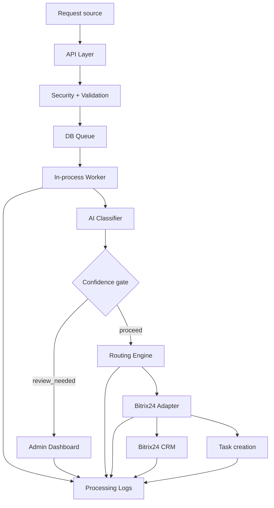

# Architecture

## Architectural context
The system is designed as a request intake and processing pipeline with a durable DB-backed queue, an in-process worker, and explicit integration seams for AI and Bitrix24.

The first delivery is a demo/portfolio MVP, but the structure is production-capable: stateful, observable, idempotent, and replaceable by stronger infrastructure later.

## Data flow


## Layers
### API Layer
Receives intake requests, enforces validation and authentication, and writes durable records to the queue.

### DB Queue
Stores incoming requests, statuses, retries, and the processing timeline.

### In-process Worker
Processes queued items in the same application process for the MVP and keeps the execution model simple.

### AI Classifier
Produces structured extraction and classification output with mock and real provider modes.

### Routing Engine
Applies deterministic rules to decide whether a request is routed, dropped, or sent to review.

### Bitrix24 Adapter
Encapsulates CRM and task API differences, including mock and real modes.

### Admin Dashboard
Shows queue state, request details, review actions, and operational context.

### Processing Logs
Records transitions and operational events in a way that is safe for public demos and portfolio screenshots.

## State machine
```text
received -> processing -> classified -> routed -> bitrix_syncing -> completed
                       \-> review_needed
                       \-> dropped
                       \-> failed_retryable -> failed
                       \-> duplicate
```

## Mock and real modes
- `AI_PROVIDER=mock|openai` selects the AI provider.
- `BITRIX_MODE=mock|real` selects whether Bitrix24 calls are simulated or sent to a real portal.
- `BITRIX_CRM_MODE=universal|legacy` controls the CRM API shape.

## Universal and legacy Bitrix CRM modes
- Universal mode uses `crm.item.add` as the primary CRM write path.
- Legacy mode uses `crm.lead.add` for compatibility cases.
- Task creation uses `tasks.task.add` in both modes.

## Demo vs production notes
- Demo uses SQLite, mock modes, and synthetic data.
- Production hardening later should move the queue and persistence to stronger infrastructure without rewriting business rules.
- The integration boundaries should remain stable so that the demo code path can evolve rather than be replaced.

## Production upgrade path
- Replace SQLite with PostgreSQL.
- Replace the in-process worker with an external queue if needed.
- Add stronger auth and audit controls.
- Add deployment and observability tooling.
- Keep the same API, domain model, and adapter contracts where possible.
